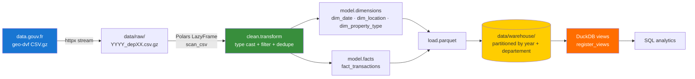
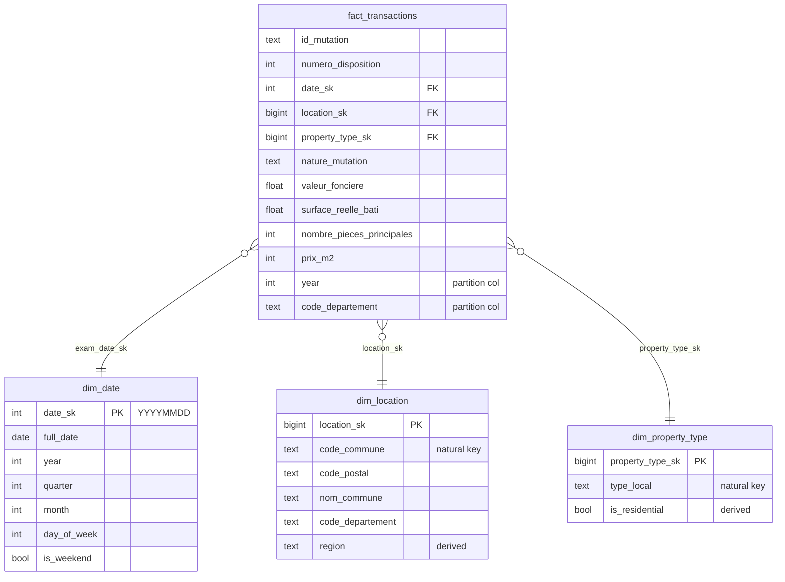

# Open Data ETL — DVF

> Batch ETL pipeline ingesting French open-data **DVF** (Demandes de Valeurs Foncières — every real-estate transaction in France) into a Parquet star-schema warehouse with DuckDB views. Polars-streamed cleanup, partitioned by year + departement.

[](https://github.com/wxssxm/open-data-etl/actions/workflows/ci.yml)
[](https://www.python.org/)
[](https://pola.rs/)
[](https://duckdb.org/)
[](LICENSE)

The DVF dataset, published yearly on [data.gouv.fr](https://files.data.gouv.fr/geo-dvf/latest/csv/), contains every real-estate transaction in France since 2014 — millions of rows per year. This project shows how to land it in a clean dimensional model with **no Spark, no warehouse, no orchestrator** — just Polars (streaming) + DuckDB on a laptop.

## Architecture



## Stack

| Layer | Technology |
| --- | --- |
| HTTP | [httpx](https://www.python-httpx.org) streaming + [tenacity](https://tenacity.readthedocs.io) retry |
| Cleaning | [Polars 1.10+](https://pola.rs) `LazyFrame` (scan_csv → collect, defers materialisation for multi-GB CSVs) |
| Storage | Parquet (zstd) — dimensions as single files, fact partitioned by (year, departement) Hive-style |
| Query | [DuckDB 1.x](https://duckdb.org) with `read_parquet` + `hive_partitioning=true` |
| CLI | [Typer](https://typer.tiangolo.com) + [Rich](https://rich.readthedocs.io) |
| Tests | pytest + [respx](https://lundberg.github.io/respx) (HTTP mocks) |
| Lint / format | ruff + black, pre-commit |
| CI / packaging | GitHub Actions, [uv](https://docs.astral.sh/uv/) |

## Star schema



## Quickstart

```bash
git clone https://github.com/wxssxm/open-data-etl.git
cd open-data-etl
cp .env.example .env

make install                                  # uv venv + deps
uv run python scripts/generate_sample.py      # writes data/sample/dvf_sample.csv

# Build the warehouse from the bundled sample (offline-friendly)
make load
ls data/warehouse/

# Or pull the real DVF dataset for a (year, departement)
DVF_YEAR=2023 DVF_DEPARTEMENT=75 make download   # ~150 MB gz for Paris
make model                                       # transforms data/raw/...gz -> data/warehouse/

# Query through DuckDB views
uv run dvf-etl query "SELECT l.nom_commune, ROUND(AVG(f.prix_m2)) AS avg_eur_m2 FROM fact_transactions f JOIN dim_location l USING (location_sk) GROUP BY l.nom_commune ORDER BY avg_eur_m2 DESC LIMIT 10"
```

A typical sample run lands 800 source rows → 789 cleaned rows → 4 dim/fact tables in well under a second.

## CLI

```bash
dvf-etl --help                                 # discover commands
dvf-etl download --year 2023 --departement 75  # fetch one CSV.gz from data.gouv
dvf-etl model                                  # raw -> warehouse (uses sample if no raw)
dvf-etl model --source path/to/file.csv.gz    # custom source
dvf-etl query "SELECT ...                      # ad-hoc SQL via DuckDB views
```

## Cleaning rules

The `clean.transform` module does just enough to produce a queryable warehouse:

| Rule | Why |
| --- | --- |
| `valeur_fonciere > 0` | Drop transactions with no/negative price (administrative artifacts) |
| Residential rows must have a positive `surface_reelle_bati` | Otherwise `prix_m2` is `NaN` and analytics break |
| Unique on `(id_mutation, numero_disposition)` | Same transaction can appear multiple times per row in the source (one row per parcel) |
| Strict types via `schema_overrides` | Polars enforces dtypes upfront — bad data fails fast |
| Streaming `scan_csv` (LazyFrame) | The collect happens after the filters, so multi-GB sources don't blow up memory |

Derived columns: `year`, `month`, `prix_m2 = round(valeur_fonciere / surface_reelle_bati)`.

## Partition layout

```
data/warehouse/
├── dim_date.parquet
├── dim_location.parquet
├── dim_property_type.parquet
└── fact_transactions/
    ├── year=2023/
    │   ├── departement=75/part-0.parquet
    │   ├── departement=69/part-0.parquet
    │   └── …
    └── year=2024/…
```

DuckDB picks up the partition columns automatically with `hive_partitioning=true`, so a query like

```sql
SELECT * FROM fact_transactions WHERE year = 2023 AND code_departement = '75'
```

prunes to a single Parquet file at planning time.

## 5 sample analytical questions

Run any of these via `dvf-etl query "<sql>"` after `make load`:

```sql
-- 1. Average price/m² per region
SELECT l.region, ROUND(AVG(f.prix_m2)) AS avg_eur_m2
FROM fact_transactions f JOIN dim_location l USING (location_sk)
GROUP BY l.region ORDER BY avg_eur_m2 DESC;

-- 2. Top 10 most expensive communes (by median price/m²)
SELECT l.nom_commune,
       MEDIAN(f.prix_m2) AS median_eur_m2,
       COUNT(*) AS sales
FROM fact_transactions f JOIN dim_location l USING (location_sk)
WHERE f.prix_m2 BETWEEN 100 AND 50000
GROUP BY l.nom_commune
HAVING COUNT(*) >= 3
ORDER BY median_eur_m2 DESC LIMIT 10;

-- 3. Houses vs flats — average price by property type
SELECT p.type_local,
       COUNT(*) AS sales,
       ROUND(AVG(f.valeur_fonciere)) AS avg_price_eur
FROM fact_transactions f JOIN dim_property_type p USING (property_type_sk)
WHERE p.is_residential
GROUP BY p.type_local;

-- 4. Monthly volume + revenue trend in 2023
SELECT d.year, d.month, COUNT(*) AS sales, SUM(f.valeur_fonciere) AS total_eur
FROM fact_transactions f JOIN dim_date d USING (date_sk)
WHERE d.year = 2023
GROUP BY d.year, d.month ORDER BY d.year, d.month;

-- 5. Are weekend mutations cheaper? (controls for type_local)
SELECT p.type_local, d.is_weekend,
       ROUND(AVG(f.prix_m2)) AS avg_eur_m2,
       COUNT(*) AS sales
FROM fact_transactions f
JOIN dim_date d USING (date_sk)
JOIN dim_property_type p USING (property_type_sk)
WHERE p.is_residential
GROUP BY p.type_local, d.is_weekend;
```

## Testing

```bash
make test           # 19 tests at 82% coverage, 70% CI gate
uv run pytest -v
```

| Suite | Count | Purpose |
| --- | --: | --- |
| `test_download` | 4 | respx-mocked TLC CDN: URL build, file write, idempotence, retry on 5xx |
| `test_clean` | 6 | Strict types, filter `valeur_fonciere > 0`, residential-surface contract, natural-key dedup, derived columns, missing-column error |
| `test_model` | 6 | dim shape, surrogate key uniqueness, `is_residential` derivation, fact-join non-null FKs, end-to-end `build_warehouse` |
| `test_load` | 3 | Hive partition layout, DuckDB view registration, end-to-end star-schema join row count |

## Reliability touches

- **Streaming everything** — `scan_csv` returns a LazyFrame, filters and casts are executed in a streamed plan, only the final `collect()` materialises. Tested against the sample but designed for multi-GB inputs.
- **Idempotent download** — same `(year, departement)` re-run is a no-op if the file already exists with size > 0.
- **Idempotent transform** — DDL is rebuilt from scratch, dimensions are deterministic (sorted natural keys → stable surrogate keys).
- **Strict source schema** — `schema_overrides` in `scan_csv` makes Polars fail on the first row with an unexpected type.
- **Partition-aware fact** — query `WHERE year = 2023 AND code_departement = '75'` reads exactly one Parquet file thanks to Hive partitioning.

## Roadmap

- [ ] Multi-year backfill in one CLI call (`dvf-etl download --years 2020:2023`)
- [ ] Incremental mode that only reprocesses partitions newer than `--since`
- [ ] Migrate Gold-equivalent (RFM-style segmentation of buyers) into a separate dbt package
- [ ] S3/MinIO backend for `data/warehouse` with credentialed DuckDB
- [ ] Slack alert when the source contract drifts (column added/renamed)

## License

MIT — see [LICENSE](LICENSE).

## Author

**Wassim Fayala** — Data Engineer apprenti @ La Forge (Paris)

[LinkedIn](https://www.linkedin.com/in/wassim-fayala/) · wassimfayala2@gmail.com
